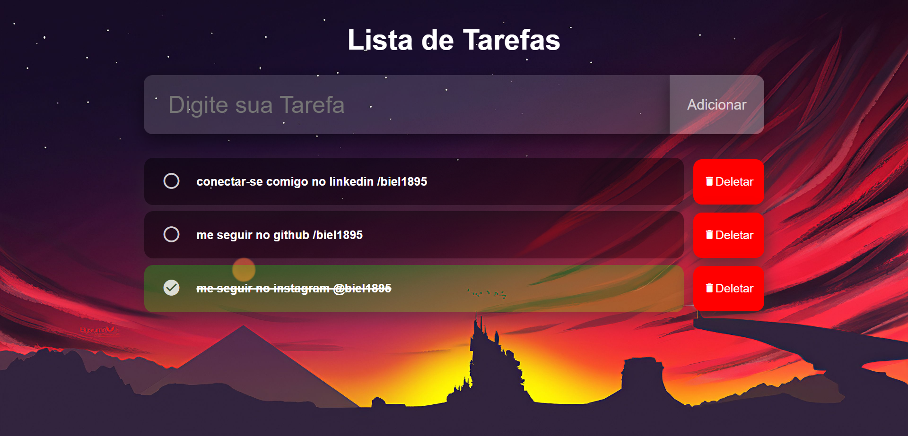

# Lista de Tarefas

Este repositório contém uma aplicação web simples para gerenciar uma lista de tarefas. A aplicação permite aos usuários adicionar novas tarefas, marcá-las como concluídas e excluí-las quando necessário.

## Tecnologias Utilizadas

A aplicação foi desenvolvida utilizando as seguintes tecnologias:

-  **HTML5:** Utilizado para estruturar a interface da aplicação.
-  **CSS3:** Utilizado para estilizar os elementos da página, proporcionando uma experiência de usuário agradável e responsiva.
-  **JavaScript:** Utilizado para adicionar interatividade à aplicação, permitindo a manipulação do DOM para adicionar, marcar e excluir tarefas dinamicamente.

## Desafios Enfrentados

Os principais desafios ao criar esta aplicação foram:

1. **Manipulação Dinâmica do DOM:** Implementar a lógica para adicionar novas tarefas, marcar tarefas como concluídas e excluí-las, tudo isso de forma dinâmica, sem a necessidade de recarregar a página.

2. **Gestão de Eventos:** Gerenciar eventos do usuário, como clicar em botões para adicionar, marcar ou excluir tarefas, e também detectar a tecla "Enter" para adicionar novas tarefas a partir do campo de entrada.

3. **Estilização Responsiva:** Criar um layout atraente e responsivo usando CSS para garantir que a aplicação seja visualmente agradável em diferentes dispositivos e tamanhos de tela.

4. **Organização do Código:** Escrever código JavaScript limpo e organizado para garantir a manutenibilidade e compreensão do código ao longo do tempo.

## Como Visualizar o Site

Você pode acessar meu site pessoal [clicando aqui](https://lista-de-tarefas-biel1895.vercel.app/).

## Como Contribuir

Sinta-se à vontade para contribuir para este projeto abrindo problemas (issues) ou enviando pull requests com melhorias. Qualquer ajuda é bem-vinda!

Esperamos que esta aplicação seja útil para quem procura uma maneira simples de gerenciar suas tarefas diárias. Obrigado por visitar este repositório!

## Autor

Gabriel Rios - Desenvolvedor

---

Obrigado por visitar meu repositório! Espero que tenha gostado do meu trabalho.
